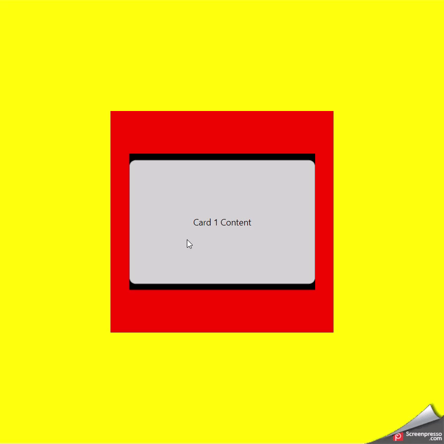

# React Native Swipeable Deck

[](https://github.com/frknltrk/react-native-swipeable-deck/stargazers)
[](https://github.com/frknltrk/react-native-swipeable-deck/blob/master/LICENSE)

React Native Swipeable Deck is a customizable swipeable card deck component for React Native applications. It allows you to create interactive card decks with swipe gestures, customizable animations, and more.



## Features

- Swipe left and right actions for navigating through cards.
- Supports dynamic card content.
- Easily integrate swipeable card decks into your React Native projects.
- Responsive design for various screen sizes.

## Usage

In order to add the package/module to your project:

```bash
# Using yarn
yarn add @frknltrk/react-native-swipeable-deck

# Using npm
npm install @frknltrk/react-native-swipeable-deck
```

## Contribution

### Example

You can find a usage example in the example folder of this repository. To run the example on the web, follow these steps:

```bash
# clone
git clone https://github.com/frknltrk/react-native-swipeable-deck.git
# install (set up)
yarn install
# run
yarn example start --web
```

### Upgrade Dependencies

Perform the steps twice: in the root dir (_/_) for the package itself and in the (_/example_) for the example app.
```bash
$ yarn outdated
```
```bash
$ yarn upgrade xxx@latest # with @latest it checks according to npm repo; otherwise package.json
# retest the package
# proceed to the next dep.
# OR just
# yarn upgrade --latest # to upgrade all packages at once
```
```bash
$ yarn install # final step
```

## TO DO
- clamp (done)
- trigger animations through buttons
- prop: isBackDisabled & isReversed 