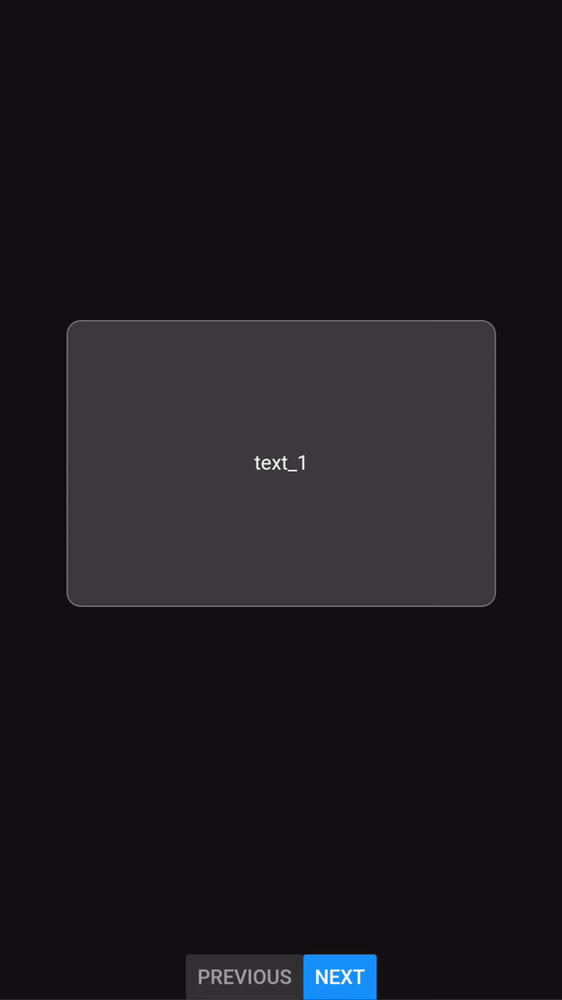

# @frknltrk/react-native-swipeable-deck

 

A swipeable card deck component for React Native, perfect for creating game-like experiences with swipe gestures. Inspired by [PartyQs](https://play.google.com/store/apps/details?id=com.partyqs), [react-native-swipe-cards-deck](https://github.com/swaplet/react-native-swipe-cards-deck) and [swipeable_card](https://github.com/ninest/swipeable_card).

Check out the **live demo** [here](https://sorsana-c18f9.web.app/).



## Features

- Support for swiping left and right
- Animated transitions for card scaling and movement
- Customizable swipe actions (e.g., disable left or right swipes)
- Easy integration with iOS and Android platforms
- Supports custom card rendering for maximum flexibility

## Installation

Install the package using npm or yarn:

```bash
$ npm install @frknltrk/react-native-swipeable-deck
```

Or using yarn:

```bash
$ yarn add @frknltrk/react-native-swipeable-deck
```

Make sure you also have the following peer dependencies installed:

```bash
$ npm install react-native-gesture-handler react-native-reanimated
```

## Basic Usage

Here’s a simple example of how to use the `SwipeableDeck` component:

```tsx
import React, { useState } from 'react';
import { Text, View } from 'react-native';
import SwipeableDeck from '@frknltrk/react-native-swipeable-deck';

const data = [
  { id: '1', text: 'Card 1' },
  { id: '2', text: 'Card 2' },
  { id: '3', text: 'Card 3' },
];

const App = () => {
  const [currentIndex, setCurrentIndex] = useState(0);

  const renderCard = (item) => (
    <View style={{ padding: 20, backgroundColor: 'lightblue' }}>
      <Text>{item.text}</Text>
    </View>
  );

  return (
    <SwipeableDeck
      currentIndex={currentIndex}
      setCurrentIndex={setCurrentIndex}
      data={data}
      renderCard={renderCard}
    />
  );
};

export default App;
```

### Props

| Prop                   | Type                           | Description                                                     | Default |
| ---------------------- | ------------------------------ | --------------------------------------------------------------- | ------- |
| `currentIndex`         | `number`                       | Index of the current card to be displayed.                      | `0`     |
| `setCurrentIndex`      | `(index: number) => void`      | Callback to update the current card index.                      |         |
| `data`                 | `T[]`                          | Array of data items for the deck.                               | `[]`    |
| `renderCard`           | `(item: T) => React.ReactNode` | Function to render each card.                                   |         |
| `swipeLeftDisabled`    | `boolean`                      | Disables left swipe when set to true.                           | `false` |
| `swipeRightDisabled`   | `boolean`                      | Disables right swipe when set to true.                          | `false` |
| `backwardMoveDisabled` | `boolean`                      | Disables backward movement (going to the previous card).        | `false` |
| `actionsReversed`      | `boolean`                      | Reverses the swipe actions (left for next, right for previous). | `false` |

### Example with Swipe Restrictions

```tsx
<SwipeableDeck
  currentIndex={currentIndex}
  setCurrentIndex={setCurrentIndex}
  data={data}
  renderCard={renderCard}
  swipeLeftDisabled={true} // Disable left swipe
  swipeRightDisabled={false} // Allow right swipe
/>
```

## Development

If you want to contribute or modify the package, you can run the example app:

```bash
$ npm run bootstrap
$ npm run example
```

### To Do

- [x] clamping
- [ ] trigger swipe animations through buttons
- [x] add props: swipeLeftDisabled, swipeRightDisabled
- [x] add props: backwardMoveDisabled, actionsReversed

### Scripts

| Command           | Description                             |
| ----------------- | --------------------------------------- |
| `npm run test`    | Run tests using Jest                    |
| `npm run lint`    | Lint your code using ESLint             |
| `npm run release` | Create a new release using `release-it` |

## License

This project is licensed under the MIT License. See the [LICENSE](LICENSE) file for more details.

## Contributing

Feel free to submit issues and pull requests! Contributions are welcome.

## Bugs & Feedback

If you encounter any issues or have suggestions for improvements, please open an issue on the [GitHub Issues page](https://github.com/frknltrk/react-native-swipeable-deck/issues).

## Author

[@frknltrk](https://github.com/frknltrk) - Furkan Unluturk, also thanks to [@aliefee](https://github.com/aliefee) for his contributions.
